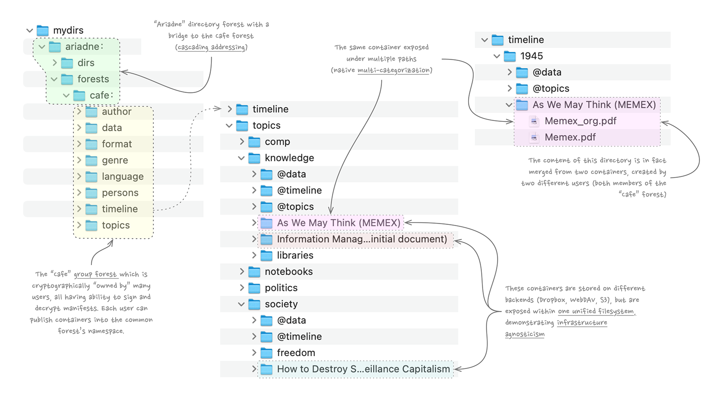

On behalf of the whole [team][team], I'm proud to announce the first public release of Wildland client! This is a reference implementation of the Wildland protocol, which we have described in our ["Why, What and How" (aka W2H) paper][w2h].

Leaving aside all the usual disclaimers about how early-beta and for-power-users-only this version really is, I'd like to focus on what's already working and possible :)

## The client functionality

Firstly, you can connect multiple storage backends (S3 buckets, WebDAV servers, Dropbox accounts, etc) and expose them all as _one unified file system_ as shown on the screenshot below. We believe that this is how data management should really be done. Users should not be concerned with which service provider their data is currently being held on. Instead, we should be able to address our data using infrastructure-agnostic addressing. Whether our files live on my Dropbox, local NAS, some p2p-synced storage, or on my local disk, should be of secondary importance, and should not be included in addressing of the data.

Secondly, Wildland natively implements what we call [multi-categorization][multicat]. This means that every data container (the smallest unit of information on Wildland) can be assigned more than one address/path and can be accessed using any of them. Functionality-wise this is similar to having a directory on a traditional filesystem with multiple links, except that on Wildland every path is a first-class citizen. We believe that this feature is vital in making filesystems powerful enough to allow for their use as a primary tool for information and knowledge management. This is a broad and exciting topic and we will be talking more about it in future posts.

Finally, the third highlight of this release is support for what we call [cascading addressing][addressing]. It can be thought of as an "upside-down DNS", or a bottom-up scalable addressing scheme which does not require any centralized authority, like predefined DNS root servers. It's important to note that this addressing scheme does not require any blockchain either.

## The Wildland demo forests

Aside from today's release of the client, we're also opening up for public read-only access [two Wildland forests][demo-forests] (a _forest_ is a namespace built around one user identity):

1. The _Pandora_ forest (a reference to the Avatar movie), which is a repository of memos, reports, documents, etc, which we've been using internally to help us with Wildland's development. It's a bit like a shared Dropbox folder, except that it uses abstracted storage and heavily utilizes multi-categorization.

2. The _Ariadne_ forest, which is a very small forest containing bridges to other forests, specifically to the Pandora forest, and some other, internal forests, which are encrypted and not exposed for public use.

## What’s coming up next?

There are more exciting things ahead of us which we plan to bring to you in the upcoming releases. These can be generally grouped into three areas:

1. Making Wildland _easier to use_ and set up. This means: better integration on various platforms, easy-to-use GUI, and -- last but not least -- an Ethereum-based marketplace for storage, followed by user-centered governance and GLM integration, as described in the [W2H paper][w2h].

2. Making Wildland _faster_ -- primarily optimized mounting of large forests, as well as adding mechanisms for container content caching.

3. Making Wildland _more universal_, which includes better integration with more storage backends, integration with various data sources, as well as adding support for compute backends attached to containers, allowing them to actively process the data inside containers.

Our ultimate goal is to provide a set of tools for a user to be able to better manage their digital universe of information. And do so on their own terms, rather than remaining dependent on large service providers to that on behalf of us all.

If you would like to try Wildland today, we suggest you start with [this introduction][intro], which is then followed by step-by-step tutorials on how to mount and explore the above-mentioned demo forests, as well as perform many other tasks using Wildland.

[team]: https://wildland.io/team
[w2h]: https://golem.foundation/resources/documents/wildland-w2h.pdf
[intro]: https://docs.wildland.io/#a-practical-introduction-to-wildland
[demo-forests]: https://docs.wildland.io/user-guide/public-forests.html
[addressing]: https://docs.wildland.io/#container-addressing
[multicat]: https://docs.wildland.io/#multi-categorization
