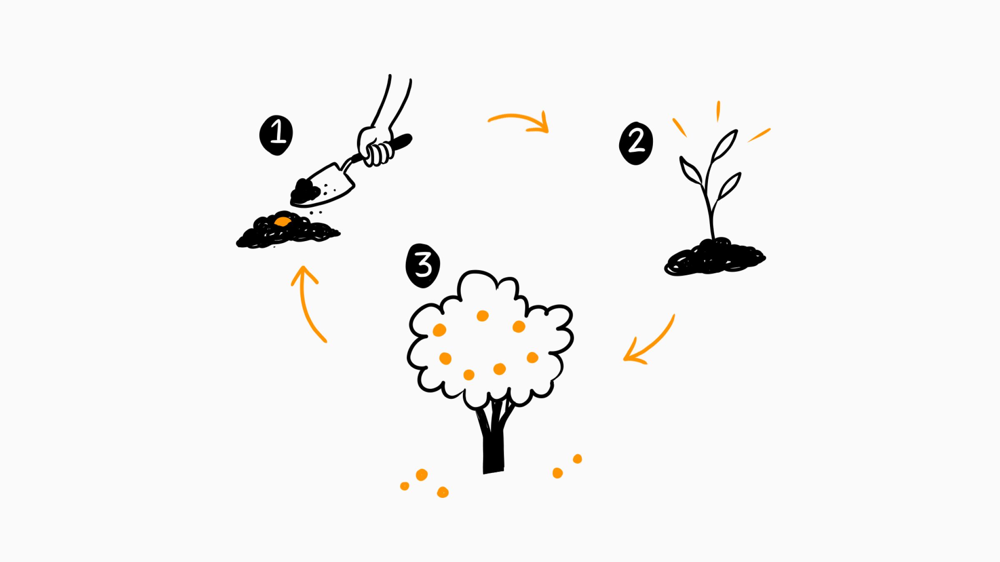
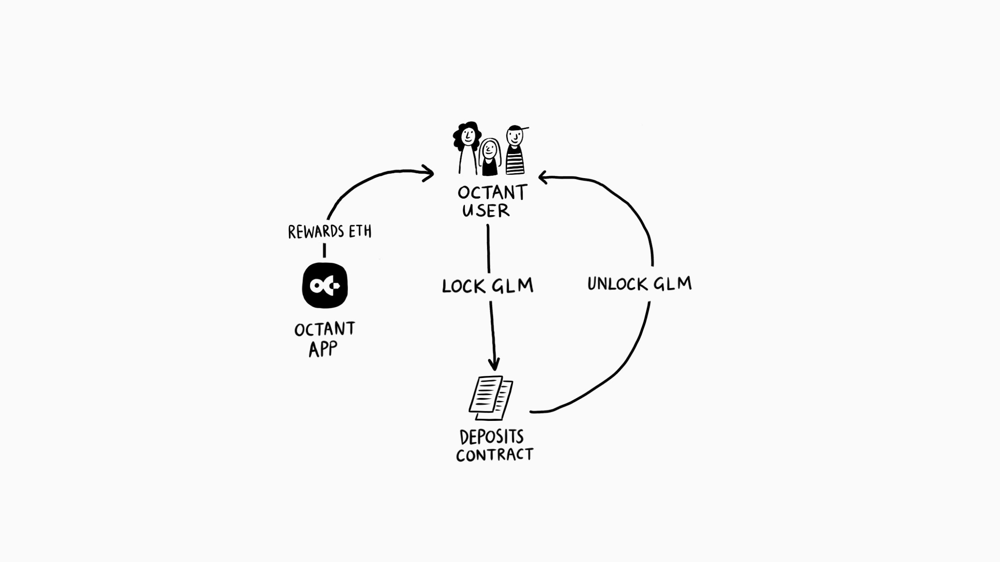

We are so excited that [Octant v1 is live](https://golem.foundation/2023/08/08/announcing-octant.html)!

In this post, we would like to present an overview of the [Octant](https://octant.app) locking mechanism and share some implementation details. Our goal is to enhance clarity regarding how this mechanism operates and why it was designed this way.



Octant is a platform for experiments in decentralized governance and community engagement. One of its primary objectives is to test hypotheses around user control, community engagement and participatory public goods funding. The first experiment is centered around the distribution of the ETH rewards, generated from the 100,000 ETH staked by the Golem Foundation. To participate in the governance process, individuals are required to "lock" some amount of GLM tokens (100 or more) in the Octant Deposits smart contract.

## GLM Locking Design

The idea behind the design of the Deposits locking contract is to make it as simple as possible and minimize any additional manipulations with GLM tokens. It is transparent and easy to understand, even for users who may not be tech-savvy.

The GLM Deposits contract only does two things:

- “Lock” by depositing GLM tokens into the contract.
- “Unlock” by withdrawing them back to the wallet.

The name is derived from the idea that you lock them into the contract for a specific duration. **It's not staking in the traditional sense.**



The Octant locking mechanism is non-custodial. It does not put the tokens into a pool or mint [Liquidity Provider tokens](https://coinmarketcap.com/alexandria/glossary/liquidity-provider-tokens-lp-tokens) for a user, nor does it engage in any other form of manipulation. Users retain complete control and can “unlock” the tokens at any moment without any losses or penalties (you can trace all GLM-locking and unlocking transactions directly on [Etherscan](https://etherscan.io/address/0x879133fd79b7f48ce1c368b0fca9ea168eaf117c#tokentxns)).

The purpose of this contract is to simply track how many GLM tokens users deposited. It gives them proportional voting power in the Octant public goods funding process, and the ability to claim rewards from the ETH staked by Golem Foundation.

## GLM Locking Strategies

Octant operates in epochs. An epoch is a designated time period (currently set at 90 days). During an epoch, Octant generates ETH staking rewards and monitors user-deposited GLM tokens. Starting from the Epoch Two the locking mechanism uses a “minimal value strategy”, which means that a user receives voting power that is proportional to the minimum amount of GLM tokens locked in each epoch. Users who maintain GLM tokens locked throughout the entire epoch have a right to vote on the funds’ distribution and ETH claims based on that amount.

In Epoch One, which is designed as an onboarding phase, the locking mechanism operates differently. Users will receive voting power proportionally to the period of time for which they have locked GLM tokens during that epoch.

If a user locks 100 GLM at the beginning of Epoch One and later adds 1000 GLM in the middle of that epoch, their resulting voting power will be proportional to 600 GLM.

```
600 GLM = 100 GLM * 1 + 1000 GLM * 0.5
```

The same scenario in Epoch Two and subsequent epochs will lead to voting power proportional to 100 GLM.

```
100 GLM = MIN(100 GLM, 1100 GLM)
```

So if a user unlocks GLM tokens within an epoch, they'll lose some voting power and ETH rewards based on the above strategy, but they'll receive back the same amount of GLM they initially locked.

You can learn more about how Octant works [here](https://docs.octant.app/technical-outline.html).

## Deposits Contract

The deposit contract's lock function performs three essential actions:

1. It tracks the current user’s deposit.
2. It deposits GLM tokens from the user’s wallet into the contract.
3. It emits an event detailing the current and previous locked amounts.

```solidity
/// @notice GLM token contract address
ERC20 public immutable glm;

/// ...

/// @notice Lock GLM to enable participation in Octant experiment.
/// This can be done at any time,
/// but it is most capital effective
/// at the end of the epoch.
/// @param amount Amount of GLM to be locked.
function lock(uint256 amount) external {
    require(amount != 0, CommonErrors.INVALID_ARGUMENT);

    uint256 oldDeposit = deposits[msg.sender];
    deposits[msg.sender] = oldDeposit + amount;
    require(
        glm.transferFrom(msg.sender, address(this), amount),
        DepositsErrors.GLM_TRANSFER_FAILED
    );
    emit Locked(oldDeposit, amount, block.timestamp, msg.sender);
}
```

The unlock function performs the opposite role:

1. It reduces the current user’s deposit in the contract.
2. It transfers the tokens back to the user’s wallet.
3. It emits an event detailing the previous and the current locked amounts.

```solidity
/// @notice Unlock GLM. This can be done at any time,
/// but it is most capital effective at the beginning of the epoch.
/// @param amount Amount of GLM to be unlocked.
function unlock(uint256 amount) external {
    uint256 oldDeposit = deposits[msg.sender];
    require(oldDeposit >= amount, DepositsErrors.DEPOSIT_IS_TO_SMALL);
    deposits[msg.sender] = oldDeposit - amount;
    require(glm.transfer(msg.sender, amount));
    emit Unlocked(oldDeposit, amount, block.timestamp, msg.sender);
}
```

That’s it, really. As simple as it gets!

Octant v1 also includes other smart contracts that manage proposals for public goods funding projects, epochs, and more. Feel free to explore the code on your own:[Octant repo](https://gitlab.com/wildland/governance/octant/-/tree/master/contracts-v1). You can also familiarize yourself with the results of the [Least Authority](https://leastauthority.com) audit of the Octant's smart contracts, which are available at [their website](https://leastauthority.com/blog/audits/audit-of-golem-foundations-octant-smart-contract/).

In upcoming versions of Octant, we will expand the functionality and the [experimental scope of community governance and public goods funding](https://docs.octant.app/beyond-the-mvp.html).

**Join us!**

- Octant website: [https://octant.build](https://octant.build)
- Octant app: [https://octant.app](https://octant.app)
- Octant documentation: [https://docs.octant.app](https://docs.octant.app)
- Octant newsletter: [https://octant.substack.com](https://octant.substack.com)
- Octant Discord server: [https://discord.gg/octant](https://discord.gg/octant)
- Octant Twitter: [https://twitter.com/OctantApp](https://twitter.com/OctantApp)
