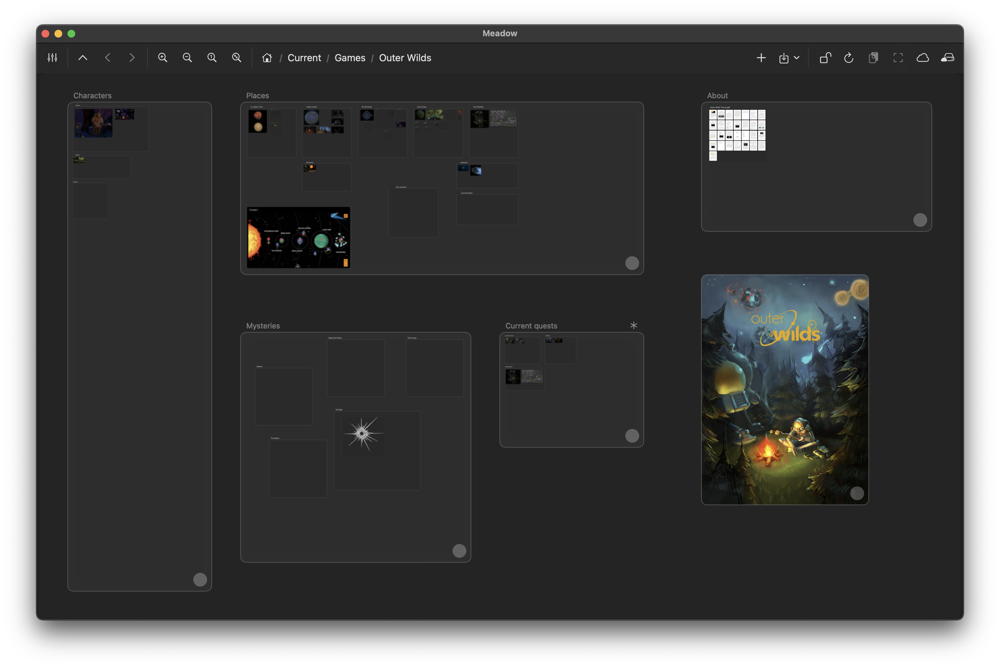
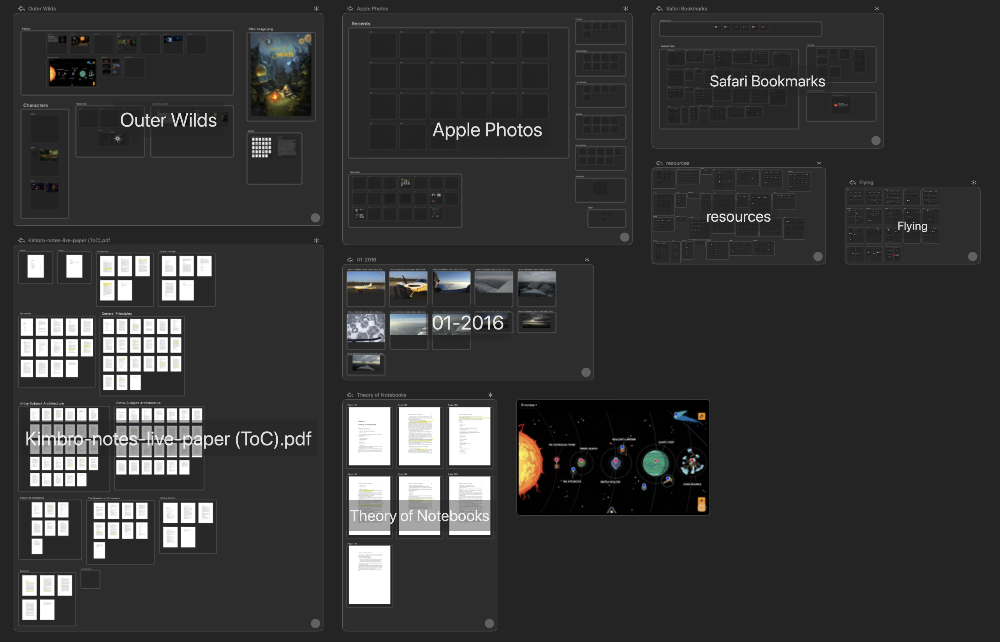
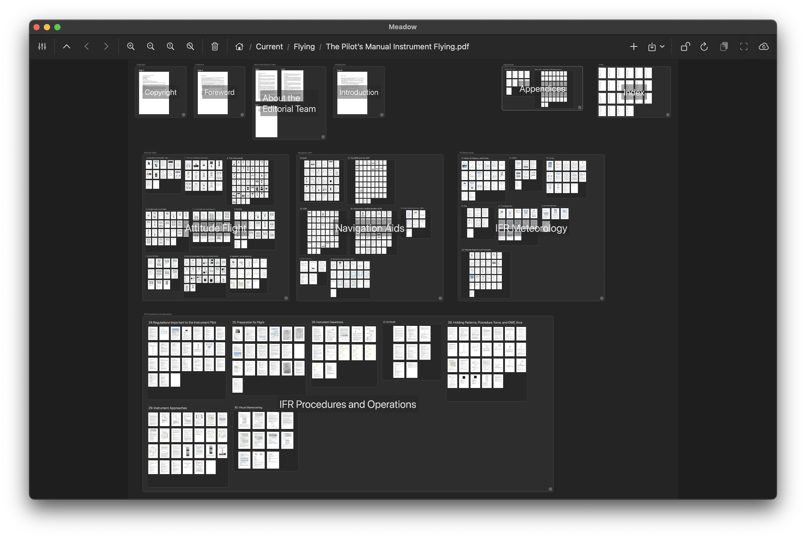
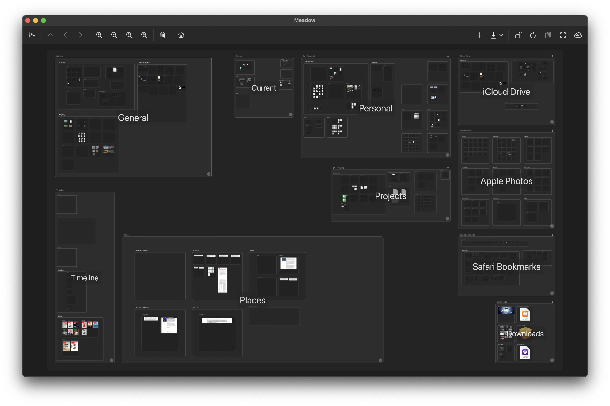
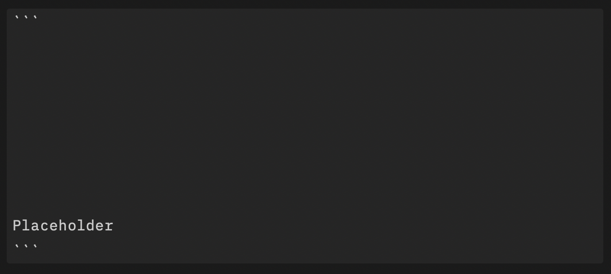
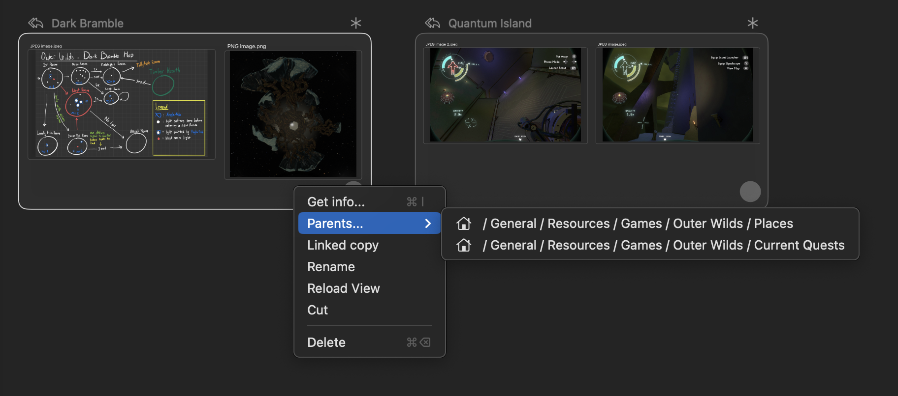
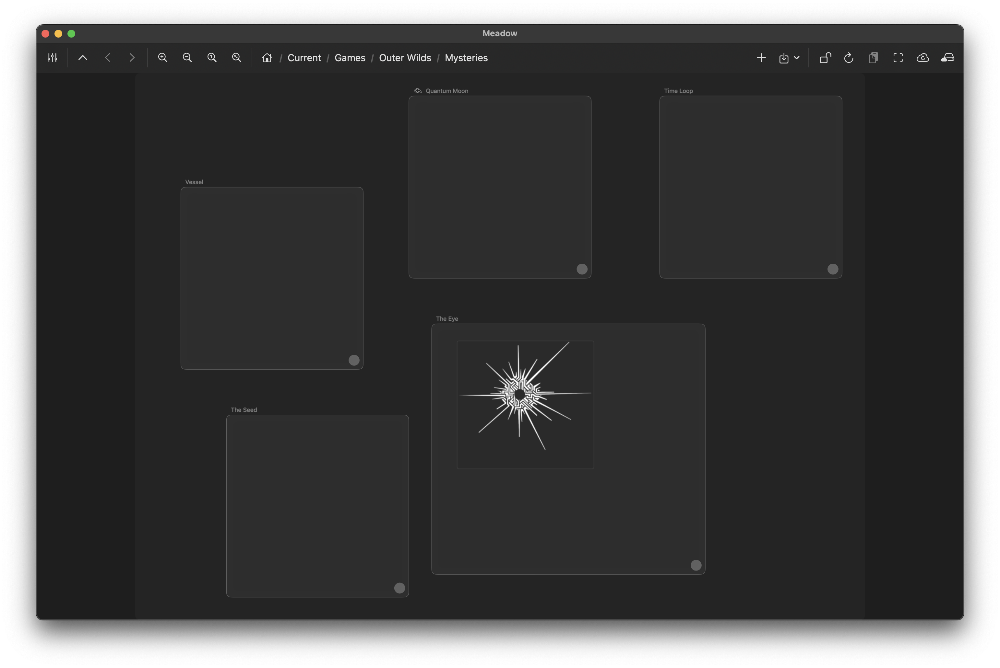

_Meadow_ tries to be a tool to help people make better sense of the vast landscape of information which we’re all emerged within.[^Wildland]

[^Wildland]: Meadow conceptually belongs into the wider initiative under the umbrella name _Wildland_ -- a set of ideas and projects we’ve been researching and developing at the Golem Foundation over the last 5 years. Still, Meadow is a standalone product, not dependent on any of the previous software we released before.

## Meadow is a visual information browser and organizer

Meadow App is similar to a file manager, except it is not just for browsing the file system, but also other kinds of information sources, such as: your documents, photo albums, music Library, Web bookmarks and many others.

Meadow is visually-oriented, presenting the user with a large board on which these information artifacts are placed. It is mostly a _browser_ rather than a content editor -- we recognize that people prefer to use whatever dedicated apps for actual content creation(be that a favorite Markdown editor, a specialized illustration app, a scribbling note-taking app, or an advanced math or music editor), rather than an one-for-all editor.


_Meadow is a visual browser for various types of information._

## Meadow Containers are basic organizational units

Just like files and folders are the basic units we interact with when we use a file manager, in Meadow we generalize these concepts into what we call _Data Containers_.


_Meadow Containers generalize the concept of files and folders._

What can be represented as a Meadow container? A folder and a file, of course. A PDF, ePUB or Markdown document, a chapter, sub-chapter, outline or section from such a document, as well as a single page or paragraph. A collection of all the photos, an album, a collection of all the photos take on a given month or day, and a specific single photo. A saved article from a read-later app, a collection of book highlights, a Web bookmark, or a history of all the Web sites visited last week. In other words: plenty of information types!

Each of these containers might be nested within other containers, representing higher-order elements -- e.g. a PDF page container nested within PDF outline-representing contain, itself nested within PDF-representing container, this one placed within a folder-presenting container, and so on.


_A hierarchy of nested containers representing a complex PDF document._

[^PdfContainer]: Of course a document such as a PDF is a file, so it can always be represented as a generic file-representing container. But by implementing a dedicated type of container for representing PDF documents, Meadow exposes the _structure_ of a PDF document in a form of sub-containers, representing PDF chapters and individual pages.

Representing all these types of data as standardized containers gives us flexibility in copying, linking, moving, and generally arranging in whatever custom structures we feel like.

This flexibility is one of the key benefits of Meadow. As otherwise we’re forced to accept whatever structures imposed on us by 3rd-party apps and websites.


_A workspace organized by topic at the top-level._

## Multi-parenting: containers can be placed in more than one parent container

The ability to nest chunks of information within other, more high-level chunks, is a crucial mechanism to organize vast amounts of information in a meaningful way.[^FsOrganizationPromise]

Otherwise, without structure, we can easily get overwhelmed with the vastness of information out there. And then we need to resort to 3rd parties for help: to search engines and/or AI assistants, so that these entities organize and manage the information _for_ us.[^DelegatingTo3rdPartiesLeft]


_Flat vs structured organization of information._

[^FsOrganizationPromise]: A crucial feature of the good old filesystem has been that we could have created practically infinitely nested structures using folders. This has been a convenient mechanism to bring order to our large collection of files. Or so it seemed... In practice, however, most people have been using flat structures for storing files, typically putting all files within `Downloads/` or `Desktop/` folders ;-) This approach has become especially attractive in the recent years, thanks to the rise of sophisticated search tools, built into all mainstream operating systems.
[^DelegatingTo3rdPartiesLeft]: But when we delegate organization of our information landscape to a 3rd party we also give up ability to _understand_ what is out there. Sure enough, we can engage in a question-answer dialog with a search engine or an AI agent, but this hardly qualifies as understanding of what is out there.
[^FormingMentalPicture]: Sure enough, by asking many questions one can start forming a mental picture of what is out there, but this mental picture will surely have some structure, perhaps only represented in our neurons, not in the filesystem, but it won’t be a flat `Downloads/` folder.

One of the prime reasons why traditional ways of organizing things into hierarchical structures can fail -- besides user’s laziness -- is the lack of flexibility the system can offer. One of the key design principle that we have been embracing since the early days of Wildland, is the _multi-parenting_ principle. It means that a container can be placed in more than one parent container. For example a container with a book about Geometry can be placed inside `Math`, `Books` and `Current study` containers. [^OrganizationExample]

[^OrganizationExample]: And the `Math` container can be placed inside both `Science` and `Cognition` containers, both of which inside the `General Knowledge` container, while the `Current study` inside `Personal`.


_Containers can be placed in more than one parent container._

## Human-friendly spatial presentation on large canvas

Container nesting and multi-parenting are powerful tools which can bring order, but can also be abused to create obscure, convoluted, human-unfriendly structures.[^UnfriendlyDeepStructures]

[^UnfriendlyDeepStructures]: A traditional example of which might be very deep table-of-contents used in many academic or technical books.

To tackle this problem, Meadow relies on spatial presentation of information. A user is free to arrange and resize the containers however she feels on the canvas.

This spatial organization seamlessly conveys important additional information such as the (subjective) importance, (logical) order and relationships between containers. All in a very informal way.[^FormalApproaches]

[^FormalApproaches]: This is in stark contrast with formal approaches to convey relationships, such as those used in Resource Description Framework. Couriousily, few formal formal approaches lets the user to assign indicators of (subjective) importance of data.


_Spatial presentation seamlessly conveys information about importance and relations_

## Integrations for apps and services

We think that Meadow should be a window into the various islands of user’s information landscapes. Those islands which are created and managed by all sorts of apps and services we use all the time: photos-management apps, calendars, read-later apps, PKM apps, file storage services, music and film streaming services, and many more.

Accessing these islands of information require app- or service-specific integration plugins. We plan to write and publish many such plugins for popular apps and services in the coming months.[^And we also plan to make it possible for 3rd parties to write such plugins.] Right now there is only a few of these integrations available, which include: local filesystem, iCloud Drive, Apple Photos, Safari bookmarks integration (only on macOS). We also provide integrations which treat some data formats, such as PDF or Markdown files as providers of information landscapes, thus exposing e.g. a PDF document as a structure of chapter and page containers, nested within each other.

## Abstracting storage away

While hiking over her unified landscape of information using the Meadow app, seamlessly jumping between various app- and web-created islands of information, a user might easily forget where all these information artifacts are actually stored... Some containers will be showing content from the local filesystem, others from cloud-based file storages, yet another ones presenting albums and photos from Apple Photos library, still others content extracted from Web services, either personalized, like read-later services, as well as general, such as Wikipedia articles on a specific topic.

Indeed, that’s one of the stated goals of Meadow -- to _decouple_ the information from its underlying storage infrastructure, so that the user didn’t have to think: “in which app or service is the piece of information I need?”.


_Abstracting storage away_

## Leaving information on the original backends

Being a _window_ into other micro-worlds created by other applications and services means that we don’t think about Meadow as of a “black hole” or a vault into which one puts all the valuable informations and locks them there. Meadow is different from most notes/PKM apps.[^WildlandStorage]


_Obsidian and Meadow showing the content of the same folder._

Still, there is some amount of (meta-)information which Meadow needs to keep track of and store within its own database. These include information about (some of) the container’s additional relations (e.g. when a container is placed in more than one parent) as well as container’s placements on the canvas (board position coordinates and container dimensions). These meta-information Meadow stores within the local SQLite DB (accessible via Apple Core Data framework) and syncs between devices using iCloud’s CloudKit database. We will describe more of the technicalities related to how Meadow manages its state and storages in a separate, upcoming post.

[^WildlandStorage]: Those who have been following our endeavors over the last 5 years might notice this “storage-less” approach to be quite different from what we have proposed in the original Wildland project. Wildland’s original goal was to additionally let the use connect various types of 3rd-party storages in order to keep these various islands of information on user-controlled storages (e.g. on user’s own S3 storage). This approach turned out to be more complex than we originally thought and so, about two years ago we have isolated these storage-related parts into a separate project called (Wildland) Cargo, which, however, we decided to discontinue last year.

## Towards unified way of accessing and organizing of information

```
- Unification of various information carriers
- Visual presentation of information and relations
  - size and position/adjacency
  - nesting
- Flexible organization mechanisms
  - simple nesting
  - multi-parenting
  - treating different types of information in the same way
- Organization done by the user rather than content provider!
```

## Current state & roadmap

```
- Meadow is an app for Apple platform: macOS and iPadOS, iPhone coming soon. Metadata sync using iCloud.
- In development for 15 months now
- Demo movie
- Signup for beta release info
```
