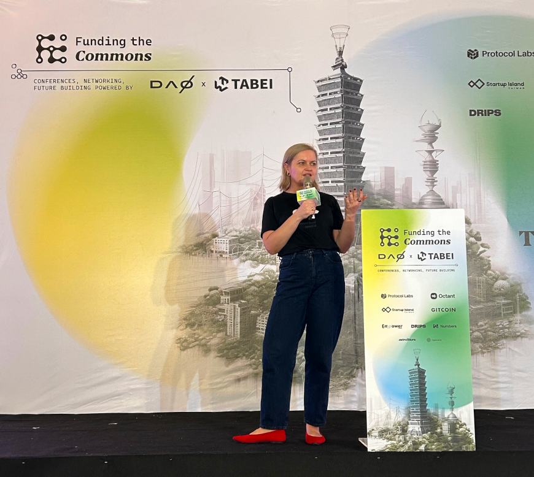

When I was introduced to the web3 space, I noticed numerous discussions about incentivizing people to join and participate in community projects. It sometimes sounds like a key solution to all problems - if we find the right incentives, everything will fall into place, and our project will be successful.

Although I may not have extensive experience in technology, I believe I possess a solid understanding of how communities and social movements function, and how to engage people in supporting causes. Therefore, I've decided to share some thoughts on this topic.

Currently, I am the CEO of one of the most popular [donation-based crowdfunding platforms](https://pomagam.pl/) in the world. My journey in traditional donation crowdfunding began in 2012 when I founded a [farmed animal advocacy organization in Poland](https://otwarteklatki.pl/). This organization later expanded to several European countries, including Ukraine and the UK, and was recognized as one of [the world's most effective animal charities](https://animainternational.org/blog/anima-international-named-one-of-the-most-effective-animal-organisations-in-the-world).

I mention this because growing a charity requires attracting donor funding. Convincing people to support animal welfare might seem straightforward, but it was a formidable challenge when our focus was on combating factory farming in a country that's among the leading producers of fur animals and one of Europe's top exporters of broiler chickens. To thrive, we really had to excel at persuading people to contribute to our cause. This means I had to learn what motivates people to give.

## So, what really motivates people to give?

Firstly, they actually buy happiness.

Research shows that donating money to the causes we believe in increases our happiness. In fact, giving some amount of money to a cause that is important to us results in a greater increase in happiness than receiving the same amount. So, **if you are running a charity that tries to solve important problems or a platform that funds public goods, then you are in the business of selling happiness, because giving makes people happy**.

This says something really cool about humanity. We care about others and are happy to support them in need. We like to buy and get cool stuff, but sometimes we are even more excited about giving to see some meaningful change in the world. Or, if we can’t change the world, at least helping to change it for this one person or animal.

Most people associate crowdfunding with platforms such as Kickstarter, where certain niches, such as gaming, have integrated it into their business models, essentially pre-selling products during crowdfunding campaigns. This approach is intuitively appealing: the company receives funds while clients obtain products, aligning with conventional commerce expectations.

However, the largest crowdfunding platform globally is not Kickstarter, but GoFundMe, which focuses on voluntary donations for a wide range of philanthropic endeavors, from healthcare expenses to memorials and crisis relief. This suggests that people are often more inclined to support causes they care about without expecting anything in return.

People donate because they want to help bring about the world you envision. They believe in your vision and wish to make a statement about it. Consider this: much of our daily consumption is about expressing our beliefs, not just consumption itself. Often, the coffee we drink, the clothes we wear, or the computer we use serve as ways to communicate who we are and what we stand for. The same principle applies to donations.

There is also something we saw clearly in our platform's data. In the past, people could start a fundraiser and offer rewards for donations or collect donations without giving any rewards. Our data analysis showed that, overall, **you collect more money when you just ask people to support you, without giving anything in return**. This would not work for Kickstarter-type fundraisers, but for charity-like projects on our platform it seems to work. It is counterintuitive for many, as **a large part of our belief system is based on the assumption that to get something, we need to give something in return**.

And maybe we actually do, but it doesn’t have to be a T-shirt, or even an NFT.

As mentioned previously, what people might want to get is happiness, being part of something bigger than themselves, and contributing to the world they want to see. **Giving is emotional, so the last thing you want is to shift the mindset from contributing to a greater good to being transactional.** Once we start thinking in terms of transactions, additional doubts arise - is it worth it? Do I want the perk? Is it the best value for my effort? Is someone else offering better stuff?

**It doesn’t mean that I think financial incentives don’t work**

They absolutely do, and that’s why we need to approach them with caution.

Let's dive right in: are we attracting the right kind of people to the web3 space? It's a relatively new field and has already become a magnet for those chasing quick, short-term profits. For many who haven’t yet experienced the creative and collaborative essence of web3, blockchain might seem like nothing more than a high-stakes gamble or a scam, needing strict control or even outright banning.

**If we genuinely want to encourage people to [BUIDL](https://twitter.com/vitalikbuterin/status/971417459872882690?lang=en) and develop this space in a way that's beneficial and socially constructive, we've got to figure out how to attract people who resonate with the challenges we're trying to address**—people who might stick around for the long haul to help us solve these issues. Those who don't bother to learn about the space will likely back the politicians calling for a crackdown every time there's new crypto drama.

Now, if our community or project is attracting people primarily for the freebies, we need to stop and think: are these the people we want or need right now? Remember, **the individuals you bring in aren’t just numbers for a progress report; they are the future of what you’re building**.

The nature and quality of the communities and individuals we engage with today are pivotal because they set the trajectory for the future. What would this future look like if the majority, or even a significant part of your community, only cared about the incentives? Are they here for the long haul? Or will they push for solutions that mostly serve their financial interest? The phenomenon of mission drift is very real and shouldn’t be brushed aside lightly.

I strongly believe that **excessive focus on incentivizing people in web3 boils down to a fundamental issue: a lack of belief in the potential for success and in the ability to create something truly new and valuable.**

If you’re under the impression that everyone who could be interested in web3 is already involved, you see it as a ['red ocean' scenario, where you're constantly battling to sway people to your side](https://hbr.org/2015/03/red-ocean-traps). But consider this: it’s still a really new and tiny space that is becoming more user-friendly, so it’s not only about the people who are already here, but about those that this niche can attract. Who are the people you really want to join your project? Those you need to incentivize with money or promise of profits, or those who actually want to do something good with you (and treat potential future profits as a nice bonus)? What you advertise is what you get.

## So, why do we believe in incentives so much?

I believe this issue stems from a bias we have when viewing others. Chip Heath conducted a study revealing a consistent overestimation of how much others are motivated by pay. Heath found that “participants listed an extrinsic incentive in the top position for themselves only 22% of the time, but they predicted that customer service representatives would list an extrinsic incentive in the top slot 85% of the time” [1]. This suggests that **while we see ourselves as driven by passion, community, vision, learning, and growth, we assume others are primarily motivated by money**. Even if money wasn't our main attraction to a field, we often think it's a key motivator for others.

Having been an activist for most of my life, I've realized that optimism about humanity is essential for continuing down this path, and I consider myself an optimist. It's always surprising, and somewhat disheartening, to see that many people hold a rather bleak view of others. This perspective might be a significant source of problems in the world. If only we could recognize more of our own doubts and hopes in others.

**I'm not suggesting that incentives are entirely ineffective. It's about acknowledging our humanity, not claiming we're angels.** In your projects, there's certainly room for a well-designed incentive system that encourages positive behaviors and discourages negative ones. However, before resorting to rewards as a panacea for all issues, why not explore strategies that have proven successful in traditional fundraising and crowdfunding fields for decades?

## What you might focus on instead

1. **Remember that giving is emotional.** It's all about how much we care about the issue and how supporting it makes us feel about ourselves. In my opinion, too much communication in this space speaks only to our rational selves, which probably reflects the current demographic. Yet, even the most rational people likely give more to charities than to support public goods projects (as valuable as they might be to the whole world), and my guess is that these charity donations weren't made after reading a paper with a cost-benefit analysis of the problem at hand. My take here is that we should try to describe the projects and ideas in this space in ways that speak to both parts of ourselves - it's both rational and emotional parts that make us human. This probably means that you need to attract or hire more people with a background in communication - and actually listen to what they say.

2. **Create compelling stories and show real people.** We understand and remember better when we hear stories. This is the main reason that in the past, people created sagas - even laws were easier to remember when told in the form of a story. We give to people and we trust people. Don't hide behind the logo of the project and the avatar; start speaking to people. It doesn't have to be very polished because people value sincerity. Yes, this might actually be uncomfortable, just like most important things in life.

3. **Make people feel that they are part of something bigger than themselves.** The field of public goods can be a perfect space to create this feeling of belonging and doing something valuable for the community. And this should be the focus of the communication for those projects. Make people understand why their help matters and how together we are changing how the world works. For the good!

4. **Do things that people actually care about.** Not every idea has a chance to spark interest in others, especially if you do not invest enough time and effort into explaining why it is important. This is one of the problems I see in many projects - often, founders spend years mulling over ideas in their heads, but then expect others to intuitively understand them after reading a few lines on the website. People have their own passions, problems, and interests, and they won't care about your project unless you make them stop, think about it, and show them why they should care.

[1] Heath, Chip. “On the Social Psychology of Agency Relationships: Lay Theories of Motivation Overemphasize Extrinsic Incentives,” _Organizational Behavior and Human Decision Processes_ 78 (1999): 25–62.

This text is based on my talk “Can we learn from traditional donation crowdfunding about what motivates people to give?” prepared for [Funding the Commons](https://fundingthecommons.io/) conference in [Taipei, 2023](https://fundingthecommons.io/taipei-2023).

\*\*Interested in diving deeper into the web3 public goods funding ecosystem? [Sign up for our free Octant newsletter](https://blog.octant.build/funding-the-commons/#/portal/signup).
