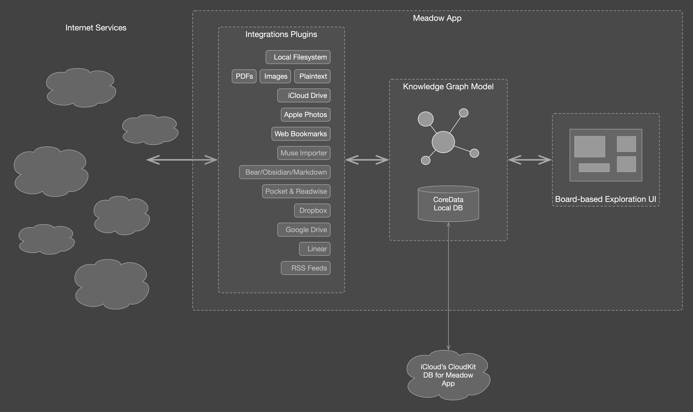

# About

Meadow aims to be a tool for improving cognitive power of a human. This is to be achieved by offering a powerful way for organization of various forms of information landscape which surrounds

Meadow App is an implementation of many of the concepts envisioned as part of the [Wildland Project](https://wildland.io/) initiative and originally described in [this paper](https://golem.foundation/resources/documents/wildland-w2h.pdf).

Meadow’s UX design has been heavily influenced by the following excellent apps: Bear and Muse. In an ideal world, where all the software was open source, Meadow would simply build on top of these excellent apps only adding features such as pluggable storage backends and auto-generated containers. Sadly, in our non-ideal world these apps turned out to be proprietary software and so Meadow’s lots of effort has been spent on re-implementing large parts of their functionalities. Meadow is going to be an open source software, once it’s first public bets is released.

_Meadow’s high-level architecture_
